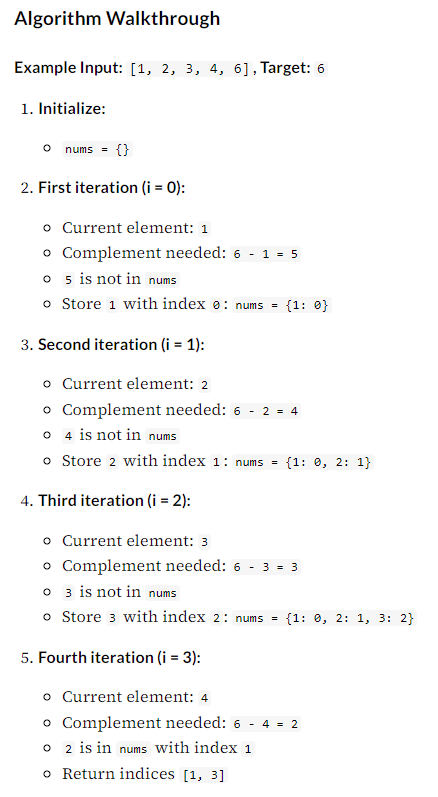

# Pair with Target Sum (easy)

## Problem Statement
- Given an array of numbers sorted in ascending order and a target sum, find a pair in the array whose sum is equal to the given target.
- Write a function to return the indices of the two numbers (i.e. the pair) such that they add up to the given target. If no such pair exists return [-1, -1].

Example 1:

- Input: [1, 2, 3, 4, 6], target=6
- Output: [1, 3]
- Explanation: The numbers at index 1 and 3 add up to 6: 2+4=6

Example 2:

- Input: [2, 5, 9, 11], target=11
- Output: [0, 2]
- Explanation: The numbers at index 0 and 2 add up to 11: 2+9=11

Constraints:

- 2 <= arr.length <= 10^4
- -10^9 <= arr[i] <= 10^9
- -10^9 <= target <= 10^9
- Only one valid answer exists.

## Solution #1 - Binary Search

- Since the given array is sorted, a brute-force solution could be to iterate through the array, taking one number at a time and searching for the second number through Binary Search. 
- The time complexity of this algorithm will be O(N * LogN). 

## Solution #2 - Two Pointers

The two-pointer approach is efficient because it takes advantage of the sorted nature of the array. By starting with one pointer at the beginning and the other at the end, we can adjust their positions based on the sum of the elements they point to. This allows us to find the pair that adds up to the target without needing to check all possible pairs, which saves time.

By moving the pointers inward, we can systematically find the pair in a single pass through the array. This ensures that the solution is both time-efficient and easy to implement.

Step-by-Step Algorithm
- Initialize two pointers: Start with one pointer (`left`) at the beginning (index 0) and the other pointer (`right`) at the end (last index) of the array.
- Loop until pointers meet: Continue the loop until `left` is less than `right`.
  - Calculate current sum: Add the elements at the left and right pointers.
  - Check if the sum matches the target:
    - If `currentSum` equals the target sum, return the indices `[left, right]`.
    - If `currentSum` is less than the target sum, increment the `left` pointer to increase the sum.
    - If `currentSum` is more than the target sum, decrement the `right` pointer to decrease the sum.
- Return default values: If no pair is found, return [-1, -1].


```py
# Time Complexity: O(n)
# Space Complexity: O(1)
class Solution:
  def search(self, arr, target_sum):
    left, right = 0, len(arr) - 1
    while(left < right):
      current_sum = arr[left] + arr[right]
      if current_sum == target_sum:
        return [left, right]

      if target_sum > current_sum:
        left += 1  # we need a pair with a bigger sum
      else:
        right -= 1  # we need a pair with a smaller sum
    return [-1, -1]

def main():
  sol = Solution();

  nums1 = [1, 2, 3, 4, 6]
  result = sol.search(nums1, 6)
  print(f"Result 1: {result}, Expected: {[1,3]}")

  nums2 = [2, 5, 9, 11]
  result = sol.search(nums2, 11)
  print(f"Result 1: {result}, Expected: {[0,2]}")


main()
```

## Solution #3 - HashTable

Instead of using a two-pointer or a binary search approach, we can utilize a HashTable to search for the required pair. We can iterate through the array one number at a time. Let’s say during our iteration we are at number ‘X’, so we need to find ‘Y’ such that “X+Y == Target”. 

We will do two things here:

Search for ‘Y’ (which is equivalent to “Target−X”) in the HashTable. If it is there, we have found the required pair. Otherwise, insert “X” in the HashTable, so that we can search it for the later numbers.

Step-by-step:
1. Initialize a HashMap:
    - Create a HashMap to store numbers as keys and their indices as values.
2. Iterate through the array:
    - Loop through each element in the array using a for loop.
3. Check for the complement:
    - For each element, check if the HashMap contains the complement (i.e., targetSum - current element).
    - If it does, return the indices of the complement and the current element.
4. Store the element and its index:
    - If the complement is not found, store the current element and its index in the HashMap.
5. Return result:
    - If no pair is found by the end of the loop, return [-1, -1].

<details>
  <summary>Example</summary>

  
</details>

```py
# Time Complexity: O(n) (can degrade to O(N^2) if collision)
# Space Complexity: O(n) 
class Solution:
  def pair_with_targetsum(self, arr, target_sum):
    nums = {}  # to store numbers and their indices
    for i, num in enumerate(arr):
      if target_sum - num in nums:
       return [nums[target_sum - num], i]
      else:
       nums[num] = i
    return [-1, -1]


def main():
  sol = Solution()
  nums1 = [1, 2, 3, 4, 6]
  result = sol.pair_with_targetsum(nums1, 6)
  print(f"Result 1: {result}, Expected: {[1,3]}")

  nums2 = [2, 5, 9, 11]
  result = sol.pair_with_targetsum(nums2, 11)
  print(f"Result 1: {result}, Expected: {[0,2]}")


main()
```