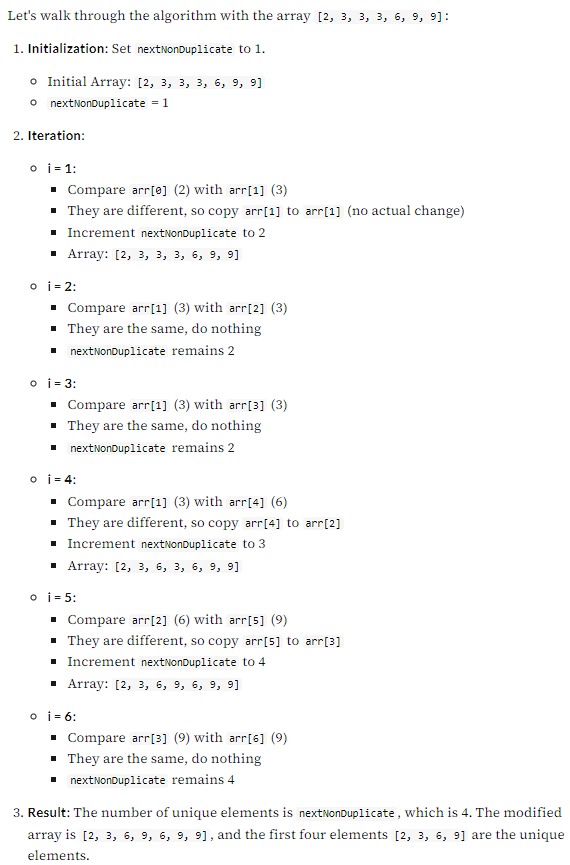

# Find Non-Duplicate Number Instances (easy)

## Problem Statement
Given an array of sorted numbers, move all non-duplicate number instances at the beginning of the array in-place. The non-duplicate numbers should be sorted and you should not use any extra space so that the solution has constant space complexity i.e., O(1).

Move all the unique number instances at the beginning of the array and after moving return the length of the subarray that has no duplicate in it.

Example 1:

- Input: [2, 3, 3, 3, 6, 9, 9]
- Output: 4
- Explanation: The first four elements after moving element will be [2, 3, 6, 9].

Example 2:

- Input: [2, 2, 2, 11]
- Output: 2
- Explanation: The first two elements after moving elements will be [2, 11].

Constraints:
- 1 <= `nums.length` <= 3 * 10$4
- -100 <= `nums[i]` <= 100
- `nums` is sorted in non-decreasing order

## Solution

In this problem, we need to separate the duplicate elements in-place such that the resultant length of the array remains sorted. As the input array is sorted, one way to do this is to shift the elements left whenever we encounter duplicates. In other words, we will keep one pointer for iterating the array and one pointer for placing the next non-duplicate number. So our algorithm will be to iterate the array and whenever we see a non-duplicate number we move it next to the last non-duplicate number we’ve seen.

Step-by-Step Algorithm
- Initialize the Index: Start by initializing a variable `nextNonDuplicate` to 1. This variable will keep track of the position where the next unique element should be placed.
- Iterate Through the Array: Loop through the array starting from the second element (index 1) to the end of the array.
- Compare Elements: For each element, check if it is different from the element at the position `nextNonDuplicate - 1`.
  - If Different: If the current element is different from the element at `nextNonDuplicate - 1`, copy the current element to the position `nextNonDuplicate`.
  - Increment Index: Increase the `nextNonDuplicate` index by 1 to point to the next position for a unique element.
- Return Result: After completing the iteration, return the value of `nextNonDuplicate`, which represents the number of unique elements in the array.

<details>
  <summary>Example</summary>

  
</details>

```py
# Time Complexity: O(n)
# Space Complexity: O(1) 
class Solution:
  def moveElements(self, arr):
    # Initialize the index for the next non-duplicate element
    next_non_duplicate = 1

    # Initialize the main loop index
    i = 0

    # Iterate through the array
    while i < len(arr):
      # Check if the current element is different from the previous element
      if arr[next_non_duplicate - 1] != arr[i]:
        # If different, update the next_non_duplicate element and copy the current element
        arr[next_non_duplicate] = arr[i]

        # Increment the next_non_duplicate index
        next_non_duplicate += 1

      # Increment the main loop index
      i += 1

    # Return the length of the modified array as the result
    return next_non_duplicate

# Entry point of the program
def main():
  # Create an instance of the Solution class
  sol = Solution()

  # Test the 'moveElements' method with example arrays
  print(sol.moveElements([2, 3, 3, 3, 6, 9, 9]))  # Output: 4 (modified array: [2, 3, 6, 9, 6, 9, 9])
  print(sol.moveElements([2, 2, 2, 11]))         # Output: 2 (modified array: [2, 11, 2, 11])

# Execute the main function
main()

```