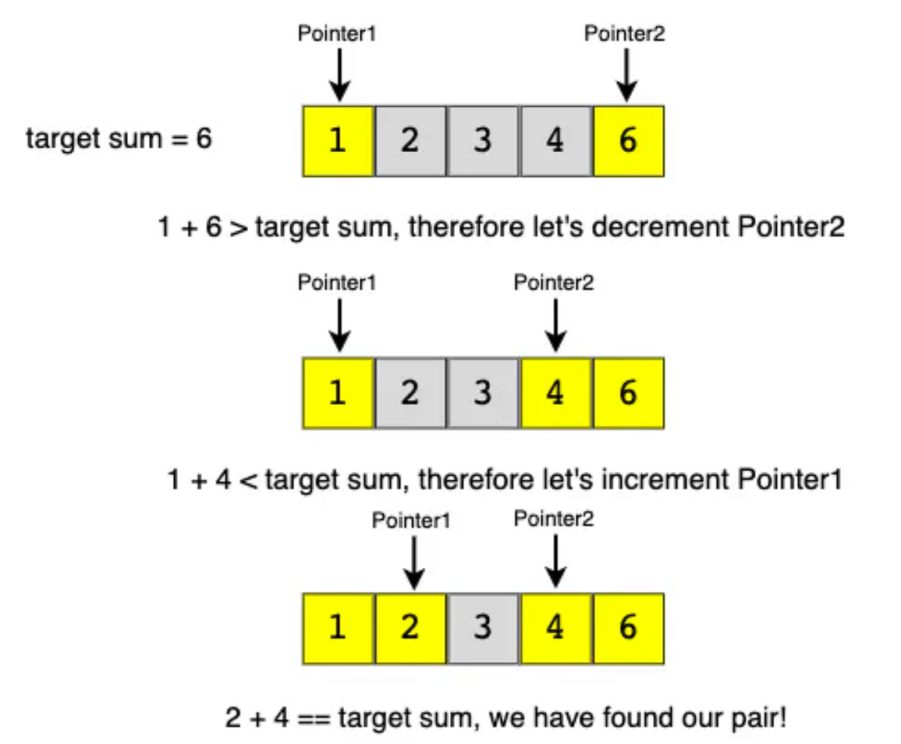

# Two Pointers Pattern

Scenarios
- Dealing with Sorted arrays or linked lists, and needing to find a set of elements that fulfill certain requirements

Example
- Problem:
  - "Given an array of sorted numbers and a target sum, find a pair in the array whose sum is equal to the given target"
- Approach:

> To solve this problem, we can consider each element one by one (indicated by the first pointer) and iterate through the remaining elements (indicated by the second pointer) to find a pair with the given sum. The time complexity of this algorithm will be O(N^2), where 'N' is the number of elements in the input array.

> Given that the input array is sorted, an efficient approach would be to start with one pointer at the beginning and another pointer at the end. At every step, we will check if the numbers indicated by the two pointers add up to the target sum. If they do not, we have two options:

> If the sum of the two numbers indicated by the two pointers is greater than the target sum, this means that we need a pair with a smaller sum. To explore more pairs, we can decrement the end-pointer.

> If the sum of the two numbers indicated by the two pointers is smaller than the target sum, this means that we need a pair with a larger sum. To explore more pairs, we can increment the start-pointer.

> The time complexity of the above algorithm will be O(N)

  
Two Pointer Algorithm Visual

  

