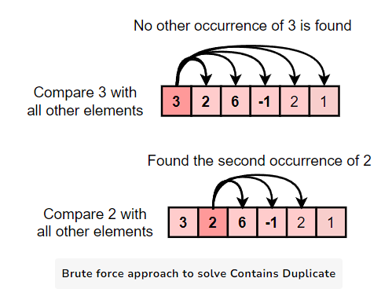

# Contains Duplicate

## Problem Statement
Given an integer array nums, return true if any value appears at least twice in the array, and return false if every element is distinct.

*Example 1:*

Input: nums= [1, 2, 3, 4]
Output: false  
Explanation: There are no duplicates in the given array.

*Example 2:*

Input: nums= [1, 2, 3, 1]
Output: true  
Explanation: '1' is repeating.

*Constraints:*

1 <= nums.length <= 10^5

-10^9 <= nums[i] <= 10^9

## Approach 1: Brute Force

We can use a brute force approach and compare each element with all other elements in the array. 
If any two elements are the same, we'll return true. 
If we've gone through the entire array and haven't found any duplicates, we'll return false.

Analysis
- Time Complexity: O(N^2)
- Space Complexity: O(1)

<details>
    <summary>Brute Force</summary>



</details>

```py
class Solution:
  def containsDuplicate(self, nums) -> bool:
    for i in range(len(nums)):
      for j in range(i + 1, len(nums)):
        if nums[i] == nums[j]: # if any two elements are the same, return true
          return True
    return False # if no duplicates are found, return false

if __name__ == '__main__':
  sol = Solution()
  nums1 = [1, 2, 3, 4]
  print(sol.containsDuplicate(nums1)) # Expected output: False

  nums2 = [1, 2, 3, 1]
  print(sol.containsDuplicate(nums2)) # Expected output: True

  nums3 = []
  print(sol.containsDuplicate(nums3)) # Expected output: False

  nums4 = [1, 1, 1, 1]
  print(sol.containsDuplicate(nums4)) # Expected output: True
```

## Approach 2: Using HashSet

We can use the set data structure to check for duplicates in an array.

Since a set can only hold unique elements, we can check if the elements in the given array are present more than once by adding them to a set. 
This way, we can determine if there are any duplicates in the array.

This approach works as follows:
1. A set named `unique_set` is created to store unique elements.
2. The algorithm then iterates through the input array `nums`.
3. For each element "x" in the array, the algorithm checks if "x" is already in the `unique_set`.
    
    a. If "x" is in the `unique_set`, then the algorithm returns `True`, indicating that a duplicate has been found.
    
    b. If "x" is not in the `unique_set`, then the algorithm adds "x" to the `unique_set`.
4. The iteration continues until all elements in the array have been processed.
5. If no duplicates are found, the algorithm returns False.

This approach utilizes the property of sets to store only unique elements, making it an efficient solution for finding duplicates in an array.

Analysis
- Time Complexity: O(N)
- Space Complexity: O(N)

```py
class Solution:
  def contains_duplicate(self, nums):
    unique_set = set() # Use set to store unique elements
    
    for x in nums:
      if x in unique_set: # If the set already contains the current element, return True
        return True
      unique_set.add(x) # Add the current element to the set

    return False # Return False if no duplicates found

if __name__ == '__main__':
  sol = Solution()
  nums1 = [1, 2, 3, 4]
  print(sol.contains_duplicate(nums1)) # Expected output: False

  nums2 = [1, 2, 3, 1]
  print(sol.contains_duplicate(nums2)) # Expected output: True

  nums3 = []
  print(sol.contains_duplicate(nums3)) # Expected output: False

  nums4 = [1, 1, 1, 1]
  print(sol.contains_duplicate(nums4)) # Expected output: True
```

## Approach 3: Sorting

Another approach is to sort the array first and then check for duplicates.
We'll sort the array and then iterate through it, comparing each element with the next one.
If any two elements are the same, we'll return true. 
If we've gone through the entire array and haven't found any duplicates, we'll return false.

Analysis
- Time Complexity: O(NlogN)
- Space Complexity: O(1) (if in-place sorting algorithm is used) O(N) (if sorting algorithm creates new arrary)

```py
class Solution:
  def contains_duplicate(self, nums) -> bool:
    nums.sort() # sort the array
    # use a loop to compare each element with its next element
    for i in range(len(nums) - 1):
      if nums[i] == nums[i + 1]: # if any two elements are the same, return true
        return True
    return False # if no duplicates are found, return false

if __name__ == '__main__':
  sol = Solution()
  nums1 = [1, 2, 3, 4]
  print(sol.contains_duplicate(nums1)) # Expected output: False

  nums2 = [1, 2, 3, 1]
  print(sol.contains_duplicate(nums2)) # Expected output: True

  nums3 = []
  print(sol.contains_duplicate(nums3)) # Expected output: False

  nums4 = [1, 1, 1, 1]
  print(sol.contains_duplicate(nums4)) # Expected output: True
```